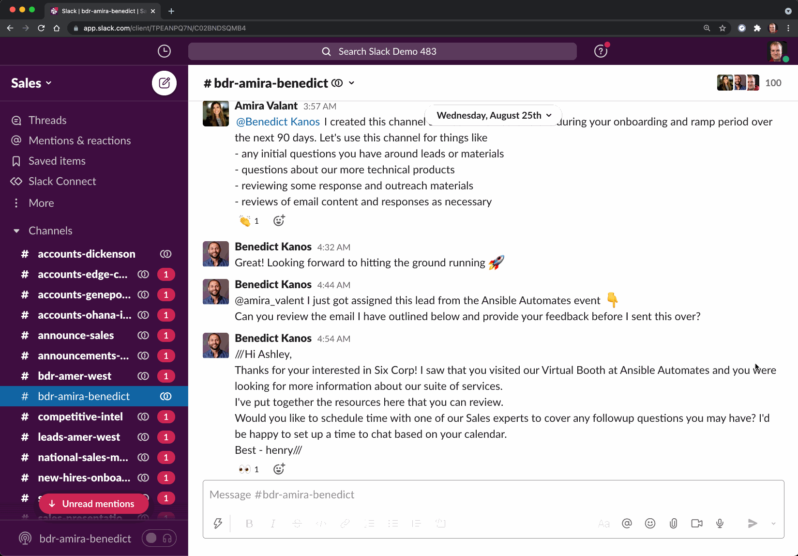

# Reacjilator for Slack

Reacjilator translates a message when a user reacts with an emoji (*"reacji"*). For example, when a message gets a `:flag-de:` reacji, this bot translates the original message to German and posts it in the message thread.



## Set Up Your Slack App

1. Create an app at your Slack App Settings page at [api.slack.com/apps](https://api.slack.com/apps)
2. Choose "From an app manifest", select the workspace you want to use, then paste the contents of [`manifest.yml`](./manifest.yml) into the dialog marked "Enter app manifest below".
3. On the **OAuth & Permissions** page, install the app and get a **Bot User OAuth Token** - it begins with `xoxb-`.
4. On the **Basic Information** page, scroll down to **App-Level Tokens** and click **Generate Token and Scopes**.
5. Add the `connections:write` scope, give your token a name, and click **Generate**. Copy this new token to your `.env` file as `SLACK_APP_TOKEN`

### Credentials

Rename the `.env.sample` to `.env` and fill the env vars with your credentials. You also need Google credentials to use the Google translation API:

```
SLACK_SIGNING_SECRET=
SLACK_AUTH_TOKEN=
GOOGLE_PROJECT_ID=
GOOGLE_APPLICATION_CREDENTIALS=
```

Get Your Slack App-Level Token at **Basic Information**, And your bot token at **OAuth & Permissions**.

Get your Google Cloud project ID and application credentials at [cloud.google.com](https://cloud.google.com/translate/docs/getting-started)

